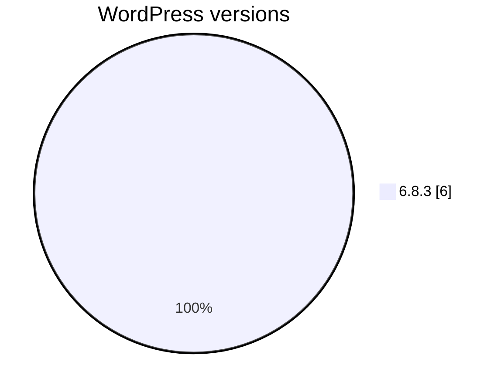
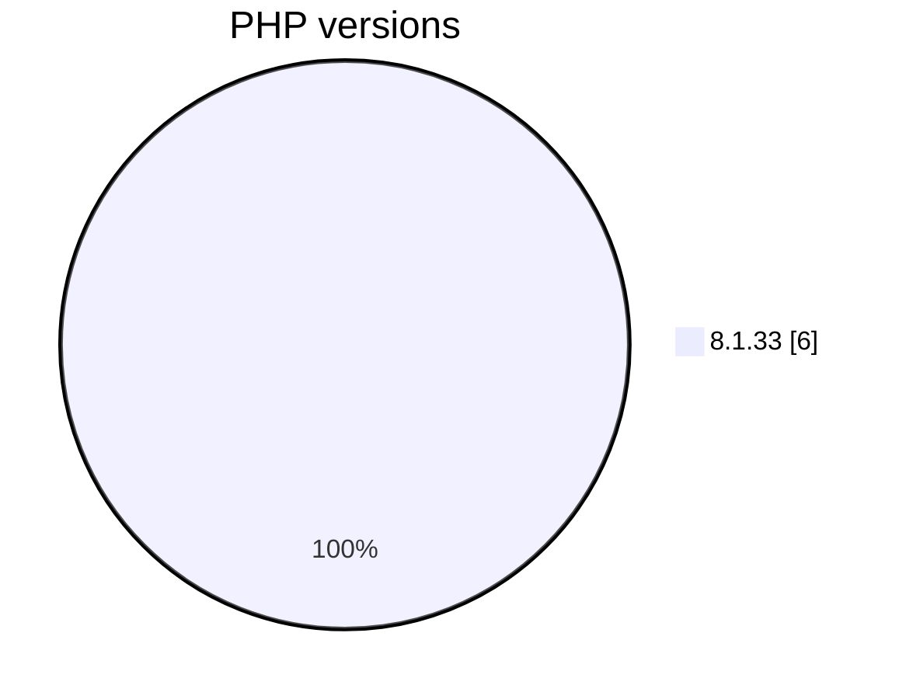
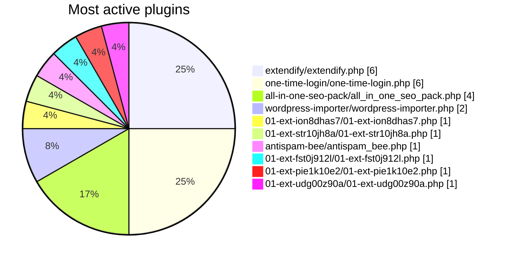
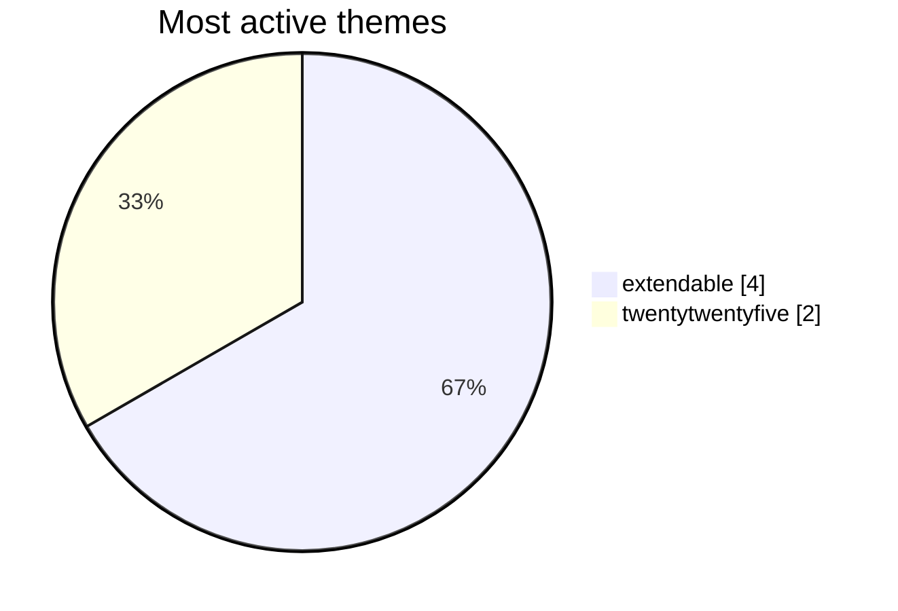
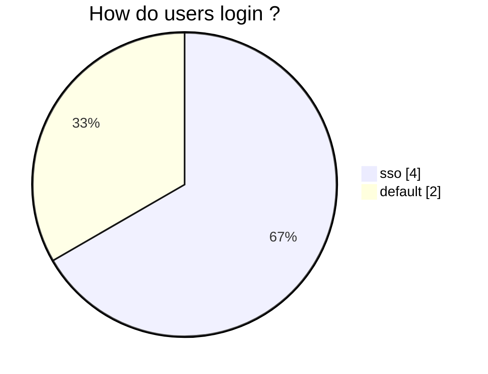
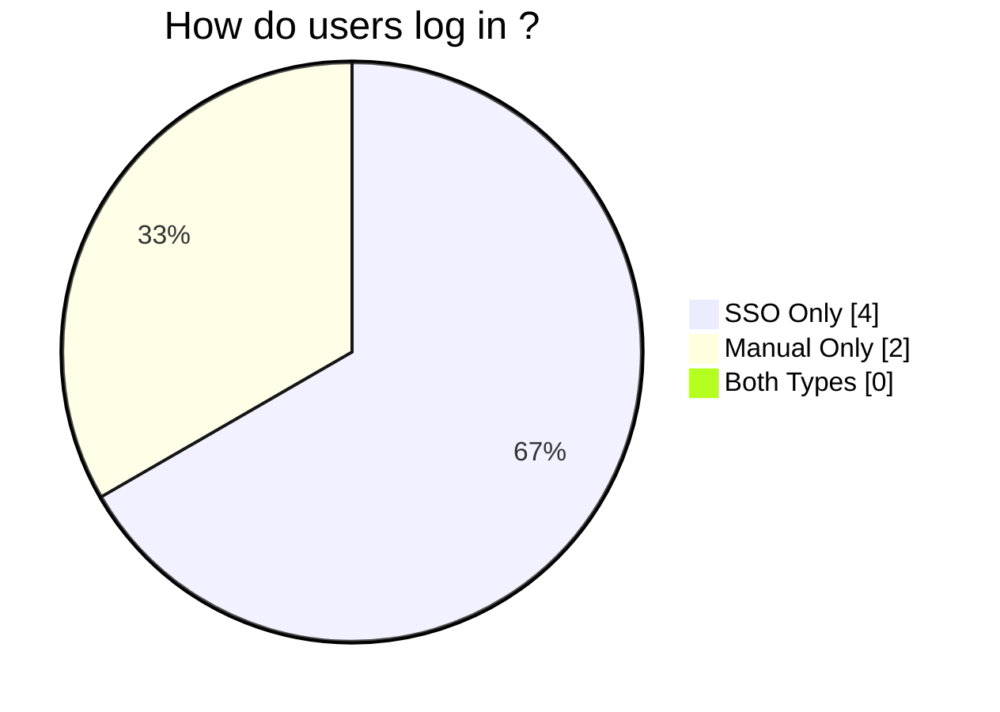

# WordPress versions

| wordpress_version | occurrence_count | percentage |
|-------------------|-----------------:|-----------:|
|  6.8.3            | 6                | 100.0      |

# PHP versions

| php_version | occurrence_count | percentage |
|-------------|-----------------:|-----------:|
|  8.1.33     | 6                | 100.0      |

# Most active plugins

> **IONOS plugins are excluded from the report.**

|                    slug                     | occurrence_count | percentage |
|---------------------------------------------|-----------------:|-----------:|
| extendify/extendify.php                     | 6                | 100.0      |
| one-time-login/one-time-login.php           | 6                | 100.0      |
| all-in-one-seo-pack/all_in_one_seo_pack.php | 4                | 66.67      |
| wordpress-importer/wordpress-importer.php   | 2                | 33.33      |
| 01-ext-pie1k10e2/01-ext-pie1k10e2.php       | 1                | 16.67      |
| 01-ext-udg00z90a/01-ext-udg00z90a.php       | 1                | 16.67      |
| 01-ext-ion8dhas7/01-ext-ion8dhas7.php       | 1                | 16.67      |
| 01-ext-ars792ni2/01-ext-ars792ni2.php       | 1                | 16.67      |
| 01-ext-fst0j912l/01-ext-fst0j912l.php       | 1                | 16.67      |
| 01-ext-str10jh8a/01-ext-str10jh8a.php       | 1                | 16.67      |
| antispam-bee/antispam_bee.php               | 1                | 16.67      |

# Most active themes

|       slug       | occurrence_count | percentage |
|------------------|-----------------:|-----------:|
| extendable       | 4                | 66.67      |
| twentytwentyfive | 2                | 33.33      |

# How do users login ?

# Active customers logged into WordPress in the last 7 days

(2025-11-13 - 2025-11-06)

| sso | manual | both |
|----:|-------:|-----:|
| 4   | 2      | 6    |

# How do users log in ?

> sso, manual or mixing both login types

